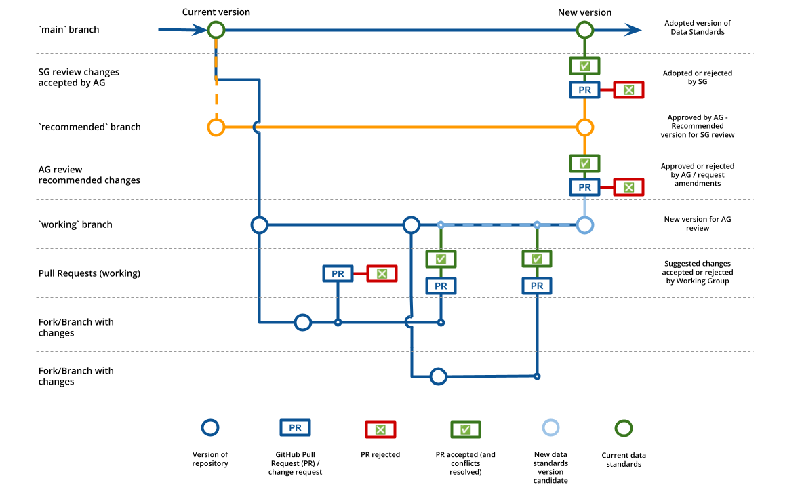

# Updating process for Stream data standards

The update process for Stream data standards was agreed by all participants at the third Stream Data Standards Workstream meeting on 15th January 2024.

## Changes provided via Pull Requests (PR)

It was agreed that changes would be suggested using the [GitHub Pull Request (PR)](https://docs.github.com/en/pull-requests/collaborating-with-pull-requests/proposing-changes-to-your-work-with-pull-requests/about-pull-requests) tooling. 

PRs are used in a GitHub repository to suggest changes for the content within that repository.

A PR will be created for every change once the Data Standards are agreed.

## Allowing changes from outside Stream

It was agreed that the repository would allow for PRs to be created from external repositories.

This decision provides for organisations and people external to Stream who want to suggest changes to be able to do so.

## Adapt and adopt the GOV.UK "Merge a Pull Request" process

It was agreed that Stream would adapt and adopt the "Merge a Pull Request" process outlined at [https://docs.publishing.service.gov.uk/manual/merge-pr.html](https://docs.publishing.service.gov.uk/manual/merge-pr.html).

### Stream process for merging a pull request

1. The `main` branch is the current version of the Stream data standards.
2. The `working` branch is where the next version of the data standards is worked on.
3. Pull requests (PR) which are the same as change requests, should be to merge onto the `working` branch. Any PRs not merging to the `working` branch will be rejected.
4. A version of the `working` branch will be tagged for review by the Steering Group, and only changes included in this version will be merged onto the `main` branch after approval by the Steering Group. The `working` branch can still accept changes after the version has been tagged, but these changes will be included for review in the next version of the data standards.
5. Any PR must have at least 1 review from repository administrators before being merged on the `working` branch. 
6. No PR should be accepted and merged by the person who created the PR or anyone from their organisation. This is to ensure that there is a separation of duties and that the PR is reviewed by someone who is not the author.
7. If there are any changes needed for a request, the PR should be rejected and a new PR created after the changes have been made.
8. The GitHub review UI should be used to discuss changes, mark a PR as approved or requiring changes.*
9. The GitHub UI should be used to merge the PR.*

*The GitHub PR review interface is: [https://github.com/icebreakerone/stream-data-standards/pulls](https://github.com/icebreakerone/stream-data-standards/pulls).

A visual representation of the repository branching and process is shown here:

## Repository administrators

It was agreed that the Stream Advisory Group responsible for technology would have the authority to name and manage those who are responsible for managing Pull Requests and repository administration.

The repository administrators will be agreed by the Advisory Group, and will have the technical expertise and/or water industry knowledge to be able to understand and accept change requests.
